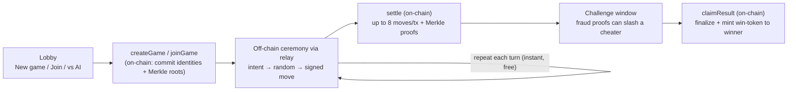

# Nix-Nax

A trustless, two-player **4×4 stacked-pieces game** on the [Midnight](https://midnight.network) blockchain, settled with **zero-knowledge proofs**. Moves are played **off-chain at memory speed** and only the result is committed on-chain — cheating is cryptographically provable, and the winner mints a shielded reward token.

It's a state channel: two players run the whole game peer-to-peer, then post a short, proof-backed summary to the chain. Nobody has to trust a server or each other — the contract and the proofs enforce the rules.

---

## The game

A stacked-pieces game on a **4×4 board**. Each player has **12 pieces** — 3 each of 4 sizes (0 = smallest … 3 = largest). A larger piece **covers** a smaller one on the same cell; the visible top piece is what counts. **Four in a row** (any row, column, or diagonal) wins.

Every turn opens with a **joint dice roll** (0–15) that decides the move type:

- roll **< 3** (~19%) → **remove** a piece (yours *or* your opponent's) from the board,
- otherwise (~81%) → **place** a piece.

Neither player controls the roll — it is the XOR of secret bits both sides committed before the game began (see [Randomness](#randomness-the-joint-roll)). The rules live in [`src/sdk/game/rules.ts`](src/sdk/game/rules.ts) and are mirrored exactly in-circuit.

---

## Quickstart

### Prerequisites

- **macOS or Linux** (ARM64 or x86_64)
- **[Bun](https://bun.sh/)** ≥ 1.1 — package manager + runtime; runs everything here (no Node.js required)
- **[Compact toolchain](https://docs.midnight.network)** — `compact --version` must work, **and** the pinned compiler must be installed: `compact update 0.31.1` (the build invokes `compact compile +0.31.1`, which does *not* auto-download it). The installer needs `xz-utils`; installing a compiler version needs `unzip` — both are present on most systems but absent from minimal images.
- The local Midnight stack (node, indexer, proof server) is downloaded and run for you by the `@effectstream/npm-midnight-*` dev dependencies.

### Run it locally

```bash
# 1. Install root dependencies
bun install

# 2. Compile the Compact contract  ->  src/contract/managed/
bun run compact

# 3. Start the local Midnight stack and wait for "Stack is up."
#    node :9944   indexer :8088   proof server :6300   (logs in .stack-logs/)
bun run stack:up

# 4. Deploy the arena contract  ->  writes webapp/public/arena.json
bun run deploy

# 5. Start the message relay on :4310 (a dumb WebSocket switchboard for moves).
#    Required for ALL play — even Practice-vs-AI marshals moves through it.
#    NOTE: use `cd <dir> && bun …` — `bun --cwd relay install` is (mis)parsed as
#    `bun run install` by current Bun and fails with "Script not found".
(cd relay && bun install && bun run start)     # relay has no deps; install is a no-op

# 6. Start the web client on :5173 (in another terminal)
(cd webapp && bun install && bun run dev)
```

Open **http://localhost:5173**, click the **Wallet** button (top-right) and use the **faucet** to fund an in-browser session wallet, then hit **New game**, **Join a game**, or **Practice vs AI**.

For a two-human game, both browsers point at the same relay + the same `arena.json`; one player creates a game and shares the **game id**, the other joins with it. Tear everything down with `bun run stack:down`.

> **Serverless by design.** There is no backend that holds keys or submits transactions. The **browser** builds, proves, and submits every on-chain call through an in-browser Midnight wallet, and pays its own gas. The relay only shuttles off-chain messages between the two players.

---

## How it works

### A state channel, not a per-turn ledger

Posting every move to a blockchain is slow and expensive: each move would be its own transaction, each needing a ZK proof and a block to land in. Nix-Nax avoids that almost entirely.



Only a handful of call types ever touch the chain — `createGame` / `joinGame` to open a game, `settle`, `claimResult`, the `startTimeout` / `claimTimeout` forfeit path, and the fraud proofs. Everything else happens peer-to-peer over the relay ([`relay/server.ts`](relay/server.ts), [`src/sdk/crypto/signed-move.ts`](src/sdk/crypto/signed-move.ts)): the mover sends an **intent**, the opponent replies with a **random reveal**, and the mover broadcasts a **signed move** that hash-chains to the previous one. Each side verifies locally before accepting.

### The three Merkle trees

When a game opens, each player commits **three Merkle roots** on-chain (six roots total). They never reveal the trees — only a leaf + its path, when needed, and the contract checks it against the root. Every leaf binds the **`gameId`**, so nothing can be replayed into another game. A player's per-game identity is `playerId = persistentHash("nixnax:id:", gameId, localSecret)` ([`src/contract/witnesses.ts`](src/contract/witnesses.ts)), proven via the `localSecret` witness — no spoofable `ownPublicKey()`.

| Tree | Depth / leaves | One leaf per… | Commits | Source |
|------|----------------|---------------|---------|--------|
| **Token (T)** | 14 / 16,384 | legal action `(turn, kind, cell, size)` — 81/turn | a salted **one-time token** authorizing that exact action | [`token-tree.ts`](src/sdk/crypto/token-tree.ts) |
| **Index (I)** | 7 / 128 | turn | the mover's chosen **slot** + their **4 roll bits** | [`index-tree.ts`](src/sdk/crypto/index-tree.ts) |
| **Random (R)** | 11 / 2,048 | `(turn, slot)` — 128 × 16 | the responder's **randomness** + their **4 roll bits** | [`random-tree.ts`](src/sdk/crypto/random-tree.ts) |

The **Token tree** is what makes cheating provable: there is exactly one token per `(turn, kind, cell, size)`. To play a move you reveal its token + path; the contract verifies it under your root. Reveal *two different* actions for the same turn and you've published two valid tokens for one turn — that's **equivocation**, and it's instantly punishable (below).

### Randomness — the joint roll

Each turn's roll is built from **both** players' pre-committed bits, so neither can bias it:

```
roll = Σ ( bit_k(mover) XOR bit_k(responder) ) · 2^k     for k in 0..3   →  0..15
remove  iff  roll < ROLL_REMOVE_THRESHOLD (= 3)          otherwise  place
```

Because both the Index and Random trees are rooted on-chain *before any turn is played*, the bits are locked in at commit time. During a turn the mover reveals their I-leaf (which picks a `slot`), the responder reveals the R-leaf at `(turn, slot)`, and `roll = XOR` of the two 4-bit values. It's a commit-then-reveal coin flip neither side can steer ([`jointRollValue` / `classOfRoll`](src/sdk/game/rules.ts), mirrored in-circuit).

### Settling on-chain, in chunks

At the end (or whenever a player wants to checkpoint), `settle` replays the agreed move log on-chain, verifying each move's Token-tree proof and detecting the win. It commits **up to 8 moves per transaction**:

```ts
// src/sdk/game/rules.ts
export const SETTLE_CHUNK = 8;
// Settle commits up to this many moves per tx. 8 keeps the settle circuit
// within the node's per-block weight budget (16 exhausted it at deploy).
```

`settle` records each move's roll *class* **optimistically** — it does not re-verify the I/R bits in-circuit (that would double the proof size). Instead, correctness is backstopped by a **challenge window** and fraud proofs.

**Why this beats submitting every turn.** A per-turn design pays one proving transaction *per move* — up to ~128 a game, each a ZK proof plus a block. Nix-Nax plays the moves **off-chain (instant, free)** and posts only the moves that matter, **8 per `settle` tx**, ending the moment someone lines up four. So a game costs roughly `⌈moves / 8⌉` settle transactions plus one `claimResult`, instead of one transaction per turn — while the fraud-proof safety net preserves the same guarantees.

### Trust model — fraud proofs & timeouts

During the challenge window after a `settle`, the opponent can slash a cheater with a single proof (the game ends immediately against the cheater):

- **`proveWrongParity`** — the claimed roll class doesn't match the XOR of the committed I/R bits.
- **`proveEquivocationByX/O`** — two valid Token-tree leaves for the same turn.
- **`proveIndexEquivocationByX/O`** — two valid Index-tree leaves for the same turn.
- **`proveRandomEquivocationByX/O`** — two valid Random-tree leaves for the same `(turn, slot)`.

If a player simply goes silent, the other arms `startTimeout` and later `claimTimeout` to claim the forfeit. Once the window closes with no successful challenge, `claimResult` finalizes the outcome and mints the win token. Wins proven by a fraud proof or claimed by timeout are equally finalizable by the winner via `claimResult`, so every win path mints. The `settle` challenge window and the `startTimeout` deadline are both bounded below on-chain (`MIN_CHALLENGE_SECS` / `MIN_TIMEOUT_SECS` in [`rules.ts`](src/sdk/game/rules.ts)), so a caller can't pick a zero-length window to skip the challenge phase or arm an instant forfeit. All of this lives in [`src/contract/NixNaxArena.compact`](src/contract/NixNaxArena.compact).

**The roll-class dispute** closes the one data-availability gap in the optimistic design: `proveWrongParity` needs the mover's Index reveal, which is only exchanged off-chain — so a mover who settled turns *unilaterally* (skipping the ceremony) could fabricate a class the opponent has no evidence to slash. Instead of bloating `settle` with per-move reveal proofs, the burden shifts on demand: the responder of a committed turn calls **`challengeRoll`** to demand that turn's evidence; the mover must **`answerRollChallenge`** with *both* ceremony reveals (their Index leaf and the responder's Random leaf, verified under both committed roots, re-deriving the roll and checking it matches the claimed class) before `respondBy`, or forfeit via **`claimRollChallenge`**. A mover who skipped the ceremony never received the responder's Random leaf and cannot forge it — so *being able to answer is itself proof the ceremony happened*. Answering with a different leaf than the ceremony one only publishes equivocation evidence against yourself. Each turn is challengeable once, one challenge pends at a time, and a pending challenge blocks `claimResult`.

---

## Win rewards — a shielded win-token

When a decided game's challenge window closes, the **winner** calls `claimResult(gameId, recipient)`, which finalizes the game and **mints exactly one shielded "win token"** to them:

```compact
mintShieldedToken(pad(32, "nixnax:win"), 1, nonce, left<...>(recipient));
```

- **Winner-only** for decided games (enforced by `callerMark` via the `localSecret` witness); **draws mint nothing**, and a unique per-game nonce means each game mints at most once.
- All wins share one token color, so **your balance of it = your number of wins**. The client derives the token type with `rawTokenType(pad32("nixnax:win"), contractAddress)` and reads it from the wallet's shielded balances ([`webapp/src/chain/arena.ts`](webapp/src/chain/arena.ts)).
- The UI shows **"🏆 Win tokens: N"** in the wallet panel and an "earned a win token" badge on the win overlay ([`WalletButton.tsx`](webapp/src/ui/WalletButton.tsx), [`GameView.tsx`](webapp/src/ui/GameView.tsx)); the loser isn't shown a (failing) Redeem button ([`useChainActions.ts`](webapp/src/ui/useChainActions.ts)).

---

## Project structure

```
src/contract/      NixNaxArena.compact — the on-chain "arena" (hosts many games) + witnesses
src/sdk/           TypeScript SDK
  crypto/            persistent hash, the three Merkle trees, signed-move ceremony
  game/              rules + GameSession (build/verify moves, settle, disputes)
  wallet, providers  in-browser Midnight wiring (build / prove / submit)
scripts/           stack-up · stack-down · deploy
relay/             message-only WebSocket switchboard (server.ts)
webapp/            Vite + React client — builds, proves, and submits in the browser
test/              contract.sim + crypto (unit) · e2e/ (live-stack)
```

---

## Testing

```bash
bun run test       # unit: contract simulation + crypto — no chain needed (113 tests)
bun run test:e2e   # end-to-end against the live local stack (happy / fraud / timeout)
bun run typecheck  # tsc --noEmit
```

`bun run test` drives the compiled circuits in pure JS via `@midnight-ntwrk/compact-runtime` — rules, lifecycle, all fraud proofs, the roll-class dispute, plus a dedicated adversarial suite (token replay, winner-flip, malicious Merkle trees, lying witnesses, the 128-turn draw, boundary values). `bun run test:e2e` deploys to a real local chain and plays full scenarios (happy / fraud / timeout, each asserting the win-token actually mints) — it needs `stack:up` running first; the suite deploys its own short-window arena (`nixnax.e2e.json`) so it never waits out production-length challenge windows.

---

## Deploying to a real network (preview / preprod / mainnet)

All configuration lives in **one root `.env`** (copy [`.env.example`](.env.example)):

- **`MIDNIGHT_*`** — read at runtime by the Node scripts (deploy, stack, e2e). `MIDNIGHT_WALLET_SEED` is the only secret.
- **`VITE_*`** — baked into the webapp bundle at `vite build` time (public, not secrets). The arena address and chain endpoints are **suffixed per network** (`VITE_ARENA_ADDRESS_PREVIEW`, `VITE_INDEXER_URL_MAINNET`, …) so one `.env` holds every network; **`VITE_NETWORK_ID`** selects which row a build targets. With nothing set, everything defaults to the local `undeployed` stack.

Per network, deploy the contract once with that network's `MIDNIGHT_*` endpoints (`bun run deploy` prints the `VITE_ARENA_ADDRESS_<NETWORK>=…` line to record), then build the webapp with `VITE_NETWORK_ID` set to that network. On real networks the in-browser session wallet/faucet and genesis wallet are disabled — players connect a browser-extension wallet and pay their own gas. Endpoints must be `https`/`wss` when the site is served over TLS.

For a Linux server, **[`deploy/SERVER_SETUP.md`](deploy/SERVER_SETUP.md)** is the full runbook — clone, install toolchains, compile, start the chain stack, deploy the arena, and serve the webapp, with per-step verification. Supporting files: [`deploy/nginx.conf.example`](deploy/nginx.conf.example) (serves `webapp/dist`, aliases the ~77 MB of compiled ZK assets at `/contract/compiled/nixnax-arena/`, proxies the `/relay` WebSocket) and [`deploy/nixnax-relay.service`](deploy/nixnax-relay.service) (systemd unit for the relay).

---

## Known issues

### Single-move opening `settle` rejected by the node (`FeeCalculation`) — needs an upstream fix

**Symptom.** The **first** `settle` of a game (from turn 0) that carries **only one move** is rejected from the mempool with `Malformed(MalformedError::FeeCalculation)` and surfaces client-side as `1010: Invalid Transaction: Custom error: 168`. It never reaches contract execution.

**Root cause (not the contract).** The fee the wallet/`midnight-js` balancing attaches and the fee the node's cost model demands disagree for the smallest possible settle transaction (minimal state reads + a single write). We verified this is **not** a contract bug and **not** related to Merkle/trie insertion cost:

- the same 1-move settle passes in the circuit simulator (no fee layer);
- a 1-move settle succeeds on-chain once the game already has committed state (a 1-move settle on turn 4, on a *deeper* ledger trie, passes — so depth is not the trigger);
- any multi-move settle passes (it performs a *superset* of the same trie inserts).

So the defect lives in the fee layer — the wallet SDK's estimate or the node's validator-side calculation — and needs fixing **upstream** (Midnight wallet SDK / node), not here.

**Workaround.** Have a game's **first** settle batch **≥ 2 moves**. This is a client-side batching choice, not a contract rule — the contract accepts single-move settles (`assert(n > 0)`), and every later single-move settle works. Details and the isolating experiment are in [`test/e2e/timeout.test.ts`](test/e2e/timeout.test.ts).

---

## Tech stack

| Layer | What |
|-------|------|
| Contract | **Compact 0.31.1** (`NixNaxArena.compact`) on **Midnight** |
| Chain access | **midnight-js** (contracts, providers, indexer) |
| Wallet | in-browser **WalletFacade** (`@midnight-ntwrk/wallet-sdk-*`, shielded + dust) |
| Client | **React + Vite + TypeScript** |
| Relay | **Bun** WebSocket service (message-only) |
| Tooling | **Bun**, **Vitest**, local Midnight stack via `@effectstream/npm-midnight-*` |

> **Version compatibility.** The compiler, JS runtime, and SDKs are pinned as a **coherent set** targeting the Midnight **preview** network — they must move together (the compiler determines the verifier-key/ledger format the runtime and proof server must match). Current pins:
>
> | Component | Version | | Component | Version |
> |---|---|---|---|---|
> | Compact compiler (`+`) | 0.31.1 | | `@midnight-ntwrk/ledger-v8` | 8.1.0 |
> | Compact devtools (`compact`) | 0.5.1 | | `@midnight-ntwrk/onchain-runtime-v3` | 3.0.0 |
> | `@midnight-ntwrk/compact-runtime` | 0.16.0 | | `@midnight-ntwrk/midnight-js-*` | 4.1.1 |
> | `@midnight-ntwrk/compact-js` | 2.5.1 | | `@midnight-ntwrk/wallet-sdk` (set) | 1.2.0 |
>
> Preview network components: node 1.0.0, indexer 4.3.3, proof server 8.1.0. Local dev uses the `@effectstream/npm-midnight-*` wrappers (their bundled dev binaries track the same ledger line).

---

## A note on naming

The product is **Nix-Nax**; the contract is **`NixNaxArena`** (on-chain identifier **`nixnax-arena`**). Package names, private-state store/DB names, and `nixnax:*` localStorage keys all follow the same `nixnax` naming.

## License

License: TBD.

## Further reading

- [Midnight docs](https://docs.midnight.network) · [Compact language](https://docs.midnight.network/develop/reference/compact).
