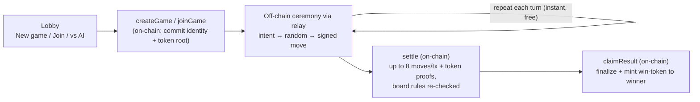

# Nix-Nax


A two-player **4×4 stacked-pieces game** on the [Midnight](https://midnight.network) blockchain, settled with **zero-knowledge proofs**. Moves are played **off-chain at memory speed** and only the result is committed on-chain — and the winner mints a shielded reward token.

> **Two versions.** This branch carries the **SIMPLIFIED (teaching) contract**: it trusts the players not to cheat, so most of the anti-cheat machinery (fraud proofs, the roll dispute, timeouts, challenge windows, two of the three Merkle trees) is gone and the whole contract is **4 circuits** you can read in one sitting — while the game itself is unchanged. The full **trustless state-channel version** is preserved two ways: **to run it, check out the git tag `advanced`** (a complete, self-consistent snapshot — 18 circuits); **to read it side by side with this one**, open [`src/contract/NixNaxArena.advanced.compact`](src/contract/NixNaxArena.advanced.compact). That copy still compiles on its own, but it is **reference only** and will not build into this tree: the witness it needs (`wit_divMod2`), the deploy stub's ledger layout, the constructor's `minWindow` argument, the `MIN_*_SECS` constants and the multi-variant settle client were all removed here along with the machinery they served. Read the simplified contract first, then the advanced one to see what removing trust costs.

What the simplified contract teaches, one concept at a time ([`src/contract/NixNaxArena.compact`](src/contract/NixNaxArena.compact)):

- **Ledger state**: `Map`s keyed by a client-generated `gameId` — one deployment hosts any number of games.
- **Circuits + asserts**: `settle` replays the agreed moves and enforces every board rule in-circuit, so the chain can never hold an illegal position.
- **Merkle commitments**: each player commits ONE root (the token tree) at create/join; every settled move must reveal its salted one-time token + path, verified in-circuit with `merkleTreePathRoot` under the mover's root.
- **Witnesses + private identity**: `playerId = persistentHash("nixnax:id:", gameId, localSecret)` — the caller proves knowledge of their secret without revealing it; no spoofable public key.
- **Shielded tokens**: `claimResult` mints exactly one `nixnax:win` token to the winner; your balance of that color = your win count.

---

## The game

A stacked-pieces game on a **4×4 board**. Each player has **12 pieces** — 3 each of 4 sizes (0 = smallest … 3 = largest). A larger piece **covers** a smaller one on the same cell; the visible top piece is what counts. **Four in a row** (any row, column, or diagonal) wins.

Every turn opens with a **joint dice roll** (0–15) that decides the move type:

- roll **< 3** (~19%) → **remove** a piece (yours *or* your opponent's) from the board,
- otherwise (~81%) → **place** a piece.

Neither player controls the roll — it is the XOR of secret bits both sides committed before the game began (see [Randomness](#randomness-the-joint-roll)). The rules live in [`src/sdk/game/rules.ts`](src/sdk/game/rules.ts) and are mirrored exactly in-circuit. (In the simplified contract the roll happens purely off-chain — the chain trusts the agreed place/remove choice.)

---

## Quickstart

### Prerequisites

- **macOS or Linux** (ARM64 or x86_64)
- **[Bun](https://bun.sh/)** ≥ 1.1 — package manager + runtime; runs everything here (no Node.js required)
- **[Compact toolchain](https://docs.midnight.network)** — `compact --version` must work, **and** the pinned compiler must be installed: `compact update 0.31.1` (the build invokes `compact compile +0.31.1`, which does *not* auto-download it). The installer needs `xz-utils`; installing a compiler version needs `unzip` — both are present on most systems but absent from minimal images.
- **[Docker](https://docs.docker.com/get-docker/)** with Compose — runs the local Midnight stack (node, indexer, proof server) from the official public images at the preview-target versions. Multi-arch, so it works on Apple Silicon too.

### Run it locally

```bash
# 1. Install root dependencies
bun install

# 2. Compile the Compact contract  ->  src/contract/managed/
bun run compact
#    (optional) confirm your keys match the deployed contract — see below:
#    bun run keys:verify

# 3. Start the local Midnight stack (Docker) and wait for the containers healthy.
#    node :9944   indexer :8088   proof server :6300
bun run stack:up

# 4. Deploy the arena contract  ->  writes webapp/public/arena.json
bun run deploy

# 5. Start the message relay on :4310 (a dumb WebSocket switchboard for moves).
#    Required for ALL play — even Practice-vs-AI marshals moves through it.
#    NOTE: use `cd <dir> && bun …` — `bun --cwd relay install` is (mis)parsed as
#    `bun run install` by current Bun and fails with "Script not found".
(cd relay && bun install && bun run start)     # relay has no deps; install is a no-op

# 6. Start the web client on :5173 (in another terminal)
(cd webapp && bun install && bun run dev)
```

Open **http://localhost:5173**, click the **Wallet** button (top-right) and use the **faucet** to fund an in-browser session wallet, then hit **New game**, **Join a game**, or **Practice vs AI**.

For a two-human game, both browsers point at the same relay + the same `arena.json`; one player creates a game and shares the **game id**, the other joins with it. Tear everything down with `bun run stack:down`.

> **No game backend.** Nothing server-side holds keys, owns game state, or submits transactions: the **browser** builds every on-chain call through an in-browser Midnight wallet, signs it, submits it to the node, and pays its own gas. The relay only shuttles off-chain messages between the two players.
>
> It is *not* dependency-free, though. Two external services are required, and both are in the Quickstart above: a **node** (+ indexer) to talk to the chain, and a **proof server** that actually generates the zero-knowledge proofs — the browser hands it the unproven transaction over HTTP (`httpClientProofProvider`) and gets the proof back. A connected extension wallet may supply its own proof server, in which case that one is used. The proof server sees the transaction's witness data but never your wallet keys, which is why it is normally run locally or by your wallet rather than by whoever hosts the site.

---

## How it works

### Off-chain play, on-chain settlement

Posting every move to a blockchain is slow and expensive: each move would be its own transaction, each needing a ZK proof and a block to land in. Nix-Nax avoids that almost entirely.



Exactly **four circuits** touch the chain — `createGame` / `joinGame` to open a game, `settle`, and `claimResult`. Everything else happens peer-to-peer over the relay ([`relay/server.ts`](relay/server.ts), [`src/sdk/crypto/signed-move.ts`](src/sdk/crypto/signed-move.ts)): the mover sends an **intent**, the opponent replies with a **random reveal**, and the mover broadcasts a **signed move** that hash-chains to the previous one. Each side verifies the game rules locally before accepting.

### The token tree — one Merkle commitment per player

When a game opens, each player commits **one Merkle root** on-chain: the root of their **token tree** — one salted leaf per legal action `(turn, kind, cell, size)`, 81 per turn, depth 14 / 16,384 leaves ([`token-tree.ts`](src/sdk/crypto/token-tree.ts)). The tree is never revealed — to settle a move you reveal just that move's **one-time token** (its salt) plus a Merkle path, and the contract recomputes the leaf with `persistentHash` and checks it sits under your committed root with `merkleTreePathRoot`. Every leaf binds the `gameId`, so nothing replays across games. (The advanced version commits two MORE trees per player to make the dice roll provable — see the trust-model section.)

### Identity — a witness, not a public key

A player's per-game identity is `playerId = persistentHash("nixnax:id:", gameId, localSecret)` ([`src/contract/witnesses.ts`](src/contract/witnesses.ts)), proven via the `localSecret` **witness** — the secret feeds the circuit privately and never appears on-chain. That is how `claimResult` stays winner-only without any spoofable `ownPublicKey()`.

### Randomness — the joint roll (off-chain)

Each turn's roll is built from **both** players' bits, so neither can bias it:

```
roll = Σ ( bit_k(mover) XOR bit_k(responder) ) · 2^k     for k in 0..3   →  0..15
remove  iff  roll < ROLL_REMOVE_THRESHOLD (= 3)          otherwise  place
```

The clients still run the full commit-then-reveal ceremony from the advanced version (each side pre-commits its bits in local Merkle trees, and reveals leaves per turn), so the dice stay fair between honest players ([`jointRollValue` / `classOfRoll`](src/sdk/game/rules.ts)). The simplified **contract** does not re-verify any of it — it trusts the agreed place/remove classes.

### Settling on-chain, in chunks

At the end (or whenever a player wants to checkpoint), `settle` replays the agreed move log on-chain — **up to 8 moves per transaction** (`SETTLE_CHUNK` in [`rules.ts`](src/sdk/game/rules.ts)) — verifying each move's one-time token under the mover's committed root, enforcing every board rule in-circuit (reserves, stacking, removals, pass legality), and detecting the win. So a game costs `createGame + joinGame + ⌈moves / 8⌉ settles + claimResult`, instead of one transaction per turn.

### Trust model — the players

**This version trusts the players.** The contract guarantees the board can never reach an illegal position (a buggy client can't corrupt a game) and that every settled move was authorized by the mover's own commitment (the token proof), but it does not try to catch a *lying* one: there are no fraud proofs, no roll verification or dispute, no timeouts, and no challenge windows. If your opponent disappears mid-game, the game simply never finishes. For how all of that is solved when players are NOT trusted — equivocation slashing over the token tree, two extra committed trees making the dice roll provable, the optimistic roll class with its dispute protocol, and timeout forfeits — read [`NixNaxArena.advanced.compact`](src/contract/NixNaxArena.advanced.compact) or check out the `advanced` tag.

---

## Win rewards — a shielded win-token

When a game is decided, the **winner** calls `claimResult(gameId, recipient)` (immediately — no waiting window in this version), which finalizes the game and **mints exactly one shielded "win token"** to them:

```compact
mintShieldedToken(pad(32, "nixnax:win"), 1, nonce, left<...>(recipient));
```

- **Winner-only** for decided games (enforced by `callerMark` via the `localSecret` witness); **draws mint nothing**, and a unique per-game nonce means each game mints at most once.
- All wins share one token color, so **your balance of it = your number of wins**. The client derives the token type with `rawTokenType(pad32("nixnax:win"), contractAddress)` and reads it from the wallet's shielded balances ([`webapp/src/chain/arena.ts`](webapp/src/chain/arena.ts)).
- The UI shows **"🏆 Win tokens: N"** in the wallet panel and an "earned a win token" badge on the win overlay ([`WalletButton.tsx`](webapp/src/ui/WalletButton.tsx), [`GameView.tsx`](webapp/src/ui/GameView.tsx)); the loser isn't shown a (failing) Redeem button ([`useChainActions.ts`](webapp/src/ui/useChainActions.ts)).

---

## Project structure

```
src/contract/      NixNaxArena.compact — the on-chain "arena" (hosts many games) + witnesses
src/sdk/           TypeScript SDK
  crypto/            persistent hash, the three Merkle trees, signed-move ceremony
  game/              rules + shared move/messaging codecs
  wallet, providers  in-browser Midnight wiring (build / balance / submit; proofs via proof server)
scripts/           stack-up · stack-down · deploy
relay/             message-only WebSocket switchboard (server.ts)
webapp/            Vite + React client — builds and submits in the browser (proof server does the proving)
test/              contract.sim + crypto (unit) · e2e/ (live-stack)
```

---

## Testing

```bash
bun run test       # unit: contract simulation + crypto — no chain needed (49 tests)
bun run test:e2e   # end-to-end against the live local stack (happy paths)
bun run typecheck  # tsc --noEmit
```

`bun run test` drives the compiled circuits in pure JS via `@midnight-ntwrk/compact-runtime` — lifecycle, every board rule per action kind, wins on rows/columns/diagonals, the 128-turn draw, and `claimResult` authorization (winner-only mint, draw by either, double-claim rejection). `bun run test:e2e` deploys to a real local chain and plays full games (single- and multi-chunk settles, asserting the win-token actually mints) — it needs `stack:up` running first; the suite deploys its own arena (`nixnax.e2e.json`) so it never clobbers the main one.

---

## Deploying to a real network (preview / preprod / mainnet)

All configuration lives in **one root `.env`** (copy [`.env.example`](.env.example)):

- **`MIDNIGHT_*`** — read at runtime by the Node scripts (deploy, stack, e2e). `MIDNIGHT_WALLET_SEED` is the only secret.
- **`VITE_*`** — baked into the webapp bundle at `vite build` time (public, not secrets). The arena address and chain endpoints are **suffixed per network** (`VITE_ARENA_ADDRESS_PREVIEW`, `VITE_INDEXER_URL_MAINNET`, …) so one `.env` holds every network; **`VITE_NETWORK_ID`** selects which row a build targets. With nothing set, everything defaults to the local `undeployed` stack.

Per network, deploy the contract once with that network's `MIDNIGHT_*` endpoints (`bun run deploy` prints the `VITE_ARENA_ADDRESS_<NETWORK>=…` line to record), then build the webapp with `VITE_NETWORK_ID` set to that network. On real networks the in-browser session wallet/faucet and genesis wallet are disabled — players connect a browser-extension wallet and pay their own gas. Endpoints must be `https`/`wss` when the site is served over TLS.

For a Linux server, **[`deploy/SERVER_SETUP.md`](deploy/SERVER_SETUP.md)** is the full runbook — clone, install toolchains, compile, start the chain stack, deploy the arena, and serve the webapp, with per-step verification. Supporting files: [`deploy/nginx.conf.example`](deploy/nginx.conf.example) (serves `webapp/dist`, aliases the ~77 MB of compiled ZK assets at `/contract/compiled/nixnax-arena/`, proxies the `/relay` WebSocket) and [`deploy/nixnax-relay.service`](deploy/nixnax-relay.service) (systemd unit for the relay).

---

## Known issues

### Single-move `settle` rejected by the node (`FeeCalculation`) — needs an upstream fix

**Symptom.** A `settle` that carries **only one move** can be rejected from the mempool with `Malformed(MalformedError::FeeCalculation)` ("exceeded the maximum time to dismiss for transaction size") and surfaces client-side as `1010: Invalid Transaction: Custom error: 168` / `SubmissionError`. It never reaches contract execution. The trigger is a settle transaction that is too *small* for its (constant) verification time — observed for the first 1-move settle of a game in the advanced version, and for every 1-move settle in an interim build without token-path payloads.

**Root cause (not the contract).** The fee the wallet/`midnight-js` balancing attaches and the fee the node's cost model demands disagree for the smallest possible settle transaction (minimal state reads + a single write). We verified this is **not** a contract bug and **not** related to Merkle/trie insertion cost:

- the same 1-move settle passes in the circuit simulator (no fee layer);
- a 1-move settle succeeds on-chain once the game already has committed state (a 1-move settle on turn 4, on a *deeper* ledger trie, passes — so depth is not the trigger);
- any multi-move settle passes (it performs a *superset* of the same trie inserts).

So the defect lives in the fee layer — the wallet SDK's estimate or the node's validator-side calculation — and needs fixing **upstream** (Midnight wallet SDK / node), not here.

**Workaround.** Batch every settle with **≥ 2 moves**: the client chunker rebalances tails (…7+2 instead of 8+1, [`player-session.ts`](webapp/src/game/player-session.ts)). This is a client-side batching choice, not a contract rule — the contract accepts single-move settles (`assert(n > 0)`). A settle whose *total* new history is a single move cannot be worked around client-side until the upstream fix. (The isolating experiment lived in the advanced version's `test/e2e/timeout.test.ts` — see the `advanced` tag.)

---

## Tech stack

| Layer | What |
|-------|------|
| Contract | **Compact 0.31.1** (`NixNaxArena.compact`) on **Midnight** |
| Chain access | **midnight-js** (contracts, providers, indexer) |
| Wallet | in-browser **WalletFacade** (`@midnight-ntwrk/wallet-sdk-*`, shielded + dust) |
| Client | **React + Vite + TypeScript** |
| Relay | **Bun** WebSocket service (message-only) |
| Tooling | **Bun**, **Vitest**, local Midnight stack via **Docker** (official preview images) |

> **Version compatibility.** The compiler, JS runtime, and SDKs are pinned as a **coherent set** targeting the Midnight **preview** network — they must move together (the compiler determines the verifier-key/ledger format the runtime and proof server must match). Current pins:
>
> | Component | Version | | Component | Version |
> |---|---|---|---|---|
> | Compact compiler (`+`) | 0.31.1 | | `@midnight-ntwrk/ledger-v8` | 8.1.0 |
> | Compact devtools (`compact`) | 0.5.1 | | `@midnight-ntwrk/onchain-runtime-v3` | 3.0.0 |
> | `@midnight-ntwrk/compact-runtime` | 0.16.0 | | `@midnight-ntwrk/midnight-js-*` | 4.1.1 |
> | `@midnight-ntwrk/compact-js` | 2.5.1 | | `@midnight-ntwrk/wallet-sdk` (set) | 1.2.0 |
>
> Preview network components: node 1.0.0, indexer 4.3.3, proof server 8.1.0. `bun run stack:up` runs exactly these versions locally from the official public Docker images (see [`deploy/docker`](deploy/docker/README.md)).
>
> **Reproducible keys.** `compact compile +0.31.1` is deterministic: the same compiler + source produce byte-identical prover/verifier keys. So a frontend built from this source generates proofs that verify against the verifier keys installed on-chain at deploy. `bun run keys:verify` checksums your compiled `src/contract/managed/keys/*` against the committed manifest [`src/contract/keys.sha256`](src/contract/keys.sha256) (the keys deployed on preview) and fails on any drift — run it after `bun run compact` to confirm your build matches the live contract.

---

## A note on naming

The product is **Nix-Nax**; the contract is **`NixNaxArena`** (on-chain identifier **`nixnax-arena`**). Package names, private-state store/DB names, and `nixnax:*` localStorage keys all follow the same `nixnax` naming.

## License

License: TBD.

## Further reading

- [Midnight docs](https://docs.midnight.network) · [Compact language](https://docs.midnight.network/develop/reference/compact).

## Watch it play

A game against the built-in AI on a local stack — rolling the joint dice, placing and covering pieces, settling the agreed history on-chain, and the win-token counter in the HUD.

<!--
  To get an inline player on github.com: drag docs/gameplay.mp4 into any GitHub
  comment box (a PR, an issue, or the web README editor), then paste the
  https://github.com/user-attachments/assets/… URL it hands back ON ITS OWN LINE
  right here. A bare URL is what GitHub turns into a player — no markdown, no
  <video> tag around it. A repo-relative path never plays inline on github.com,
  which is why the link below stays as the fallback.
-->

<video src="docs/gameplay.mp4" controls muted playsinline width="100%"></video>

[▶ docs/gameplay.mp4](docs/gameplay.mp4) (2.1 MB) — plays inline in editors and docs sites that allow the `<video>` tag; on github.com it is a download link until the URL above is filled in.
