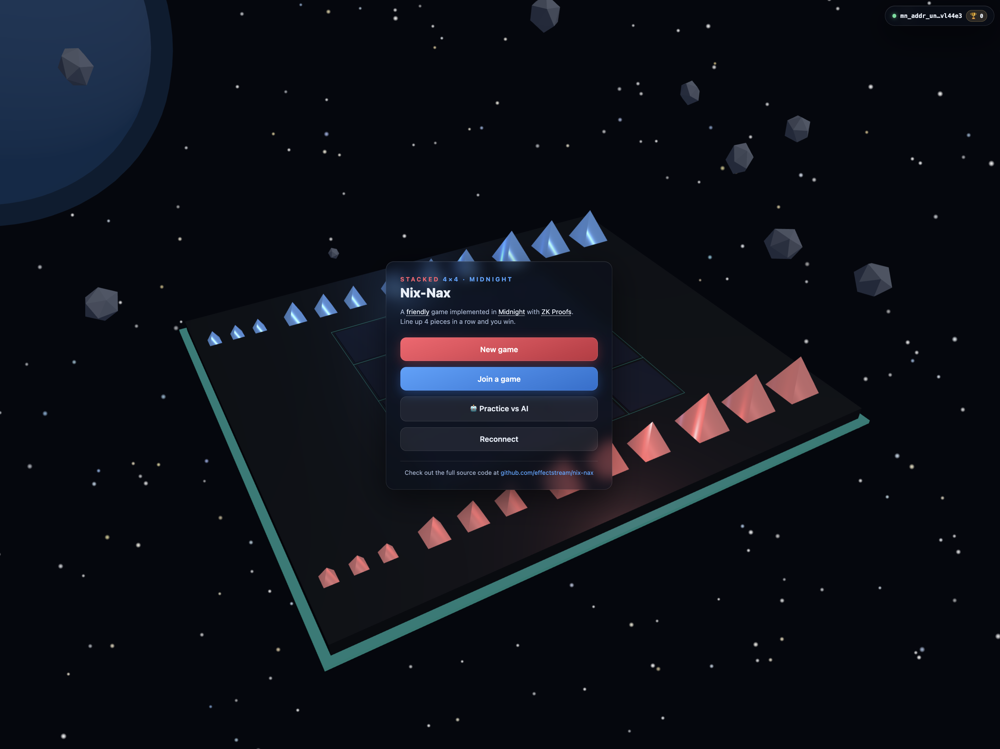

# Nix-Nax on Midnight

Nix-Nax is an advanced teaching example: a complete browser game that
demonstrates a Compact contract and wallet-driven chain interaction on
Midnight. The React and Three.js game is the runnable main example.



## Teaching scope

The lesson follows the same contract-to-client progression as the Midnight
Bulletin Board example:

| Part | Start here | What to learn |
|---|---|---|
| A — Contract | [`src/contract/NixNaxArena.compact`](src/contract/NixNaxArena.compact) | Public ledger state, four exported circuits, one-time action commitments, board-rule checks, witness-based player identity, and shielded rewards |
| B — HTML + JavaScript/TypeScript | [`docs/TEACHING_GUIDE.md`](docs/TEACHING_GUIDE.md) | Wallet discovery, network configuration, provider construction, contract attachment, public-state reads, private-state handling, transaction submission, and confirmation |
| C — Advanced reference | [`advanced/README.md`](advanced/README.md) | A separate complete-protocol contract and its known protocol defects; reference only and excluded from the default build |

The 3D board, animation, AI policy, and game-engine implementation support the
working application. They are deliberately outside the teaching path.

## Trust model

The main contract is designed for **cooperating players**. Moves happen
off-chain and are settled in batches. The contract guarantees that settled
board transitions are legal and that each move presents a one-time capability
committed by its player when the game opened.

It does not verify the off-chain dice ceremony, detect a player who lies about
the agreed action class, or force an absent opponent to continue. It has no
fraud proofs, roll disputes, challenge windows, or timeout forfeits. A stalled
or disagreeing game may remain unfinished. The separate advanced reference is
not a remedy ready for deployment; it has four documented protocol defects.

## Requirements

- Node.js 22.23.2 for Vite, Vitest, TypeScript, and production builds (`.nvmrc`)
- Bun 1.3.11 for dependency installation, the relay, and deployment scripts
- Compact compiler 0.31.1
- Docker with Compose for the local Midnight 1.x development network

The compiler and JavaScript packages target the Midnight 1.x / ledger-v8
family. Upgrade them as one compatibility set.

## Run locally

Install both locked dependency sets:

```bash
bun install --frozen-lockfile
(cd webapp && bun install --frozen-lockfile)
```

Compile the contract and verify the generated proving and verification keys:

```bash
npm run compact
bun run keys:verify
```

Start the local chain services and deploy a fresh arena. Deployment writes the
local address to `webapp/public/arena.json`:

```bash
bun run stack:up
bun run deploy
```

Run the message relay and browser client in separate terminals:

```bash
(cd relay && bun run start)
(cd webapp && npm run dev)
```

Open <http://localhost:5173>. Use the Wallet menu to fund a local session
wallet, then create, join, reconnect to, or practise against the AI. A
two-player game needs both browsers to use the same arena and relay.

Stop the local chain when finished:

```bash
bun run stack:down
```

## Deploy to another network

Copy [`.env.example`](.env.example) to `.env` and select the target network.
`MIDNIGHT_*` values configure the deploy and maintenance scripts; keep
`MIDNIGHT_WALLET_SEED` private. `VITE_*` values are public build-time browser
configuration, with network-suffixed arena and service endpoints selected by
`VITE_NETWORK_ID`.

Deploy the contract once with the target network's Midnight endpoints. The
deploy command prints the `VITE_ARENA_ADDRESS_<NETWORK>` entry to retain for
later builds:

```bash
bun run deploy
```

On preview, preprod, or mainnet, players connect an extension wallet and pay
their own fees. Browser-facing endpoints must use HTTPS/WSS when the site is
served over TLS. The full Linux hosting runbook, including the relay and nginx
configuration, is in [`deploy/SERVER_SETUP.md`](deploy/SERVER_SETUP.md).

## Chain flow

Exactly four circuits mutate the main contract:

1. `createGame` stores X's private-identity commitment and action-token root.
2. `joinGame` adds O's distinct identity and token root.
3. `settle` verifies up to eight committed actions and applies the game rules.
4. `claimResult` requires the winning player's private identity secret,
   finalizes the game, and mints one shielded win token. Either player may
   finalize a draw, which mints no token.

The browser builds these calls and pays through its active wallet. The relay
carries and temporarily retains disclosed protocol messages, including move
tokens and randomness reveals. It does not receive wallet spending keys or
unrevealed game-identity secrets, build chain transactions, or pay gas.

The configured proof provider receives the transaction and the private circuit
inputs needed to produce a proof. It does not receive an extension wallet's
spending keys through this application, but witness values can still be
sensitive. Use a proof provider you trust, normally one run locally or supplied
by the wallet.

## Project layout

```text
src/contract/       Main Compact contract, witness adapter, generated bindings target
src/sdk/            Shared commitments, rules, wallet, provider, and deployment helpers
webapp/index.html   Browser entry document
webapp/src/chain/   Compiled-contract adapter, providers, public reads, circuit calls
webapp/src/wallet/  Wallet discovery, selection, balancing, signing, and submission
webapp/src/game/    Supporting session/game implementation (outside the lesson)
webapp/src/ui/      Complete React/Three.js interface (outside the lesson)
relay/              Bun WebSocket message relay
test/               Contract simulator, crypto, and local-ledger tests
advanced/           Reference-only complete protocol contract and limitations
deploy/             Local-stack and hosted deployment material
```

## Checks

After compiling the contract, run the checks with Node:

```bash
npm test
npm run test:webapp
npm run typecheck
npm run typecheck:webapp
npm run build:webapp
```

The local-ledger suite additionally needs the Docker stack and freshly compiled
binary circuit assets:

```bash
npm run test:e2e
```

CI performs frozen dependency installs, full Compact compilation, key-manifest
verification, unit and browser-module tests, both TypeScript checks, and the
production web build. Local-ledger E2E remains an explicit longer-running check.

## Operational limitations

- The client durably saves its own protocol progress before sending and, when
  the relay opens again, replays its last authored move plus any current intent
  or randomness response. A receiving client ignores an identical historical
  move instead of advancing twice. This recovers the bounded case where the final send is lost and both players
  reconnect, including after a relay restart. It is not a general history
  reconciliation protocol: divergent or corrupt saved histories, or relay
  history-cap loss beyond the immediately replayable messages, still require
  an authenticated turn/hash handshake and acknowledgement protocol.
- Relay room roles are not authenticated. Anyone who learns a game ID can claim
  an existing role and disconnect that socket. One-time action commitments
  still protect on-chain settlement, but the bundled relay is suitable for
  local/demo coordination, not an availability-sensitive public service.
- On a fresh local stack using `midnight-node:1.0.0` with `ledger-v8:8.1.0`,
  three attempts at one legal opening-move `settle` were rejected by the node
  as `Malformed(FeeCalculation)`. This is a measured limitation of that tested
  stack, not a claim about every deployment. The client batches settlement when
  possible; a history containing only one move has no client-side workaround.

For hosted deployment details, see [`deploy/SERVER_SETUP.md`](deploy/SERVER_SETUP.md).

## License and provenance

Licensed under either of

- Apache License, Version 2.0 ([`LICENSE-APACHE`](LICENSE-APACHE))
- MIT license ([`LICENSE-MIT`](LICENSE-MIT))

at your option. SPDX: `MIT OR Apache-2.0`.
